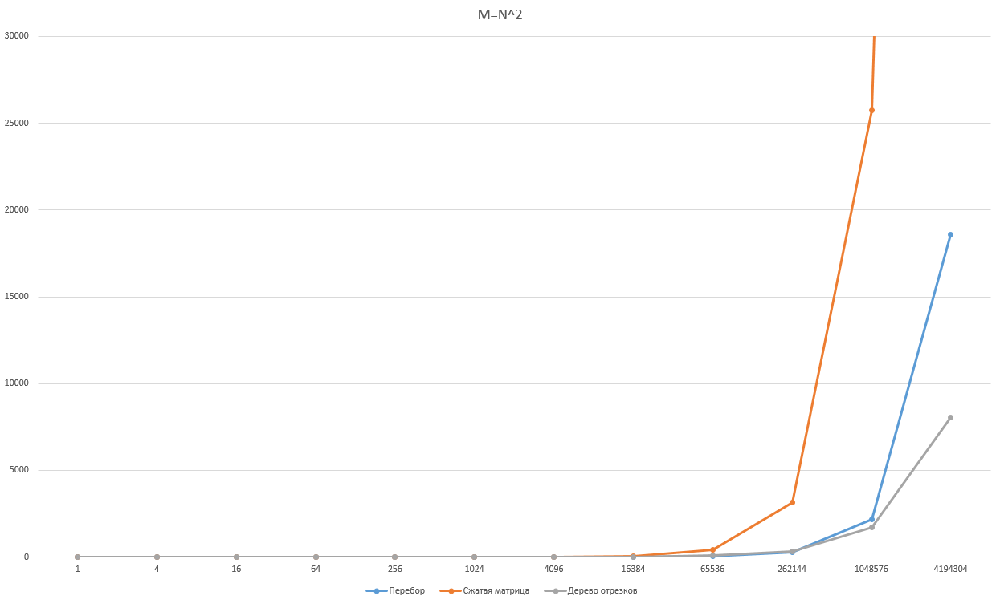

# **AlgorithmLab2** 
**Цель:** Сравнение Алгоритмов Перебора, Сжатой матрицы, Персистентного дерева отрезков.  
**Выполнил:** Трясков Алексей 22ПИ-2  
**Язык:** C++
___
# Реализация 3х алгоритмов
**Алгоритм перебора**  
Перебираем для каждой точки прямоугольник.

```C++
vector<int> search_1(vector<Rectangle>& arr, vector<Point>& req) {
    int counter;
    vector<int> res;
    for (auto& point : req) {
        counter = 0;
        for (auto& rec : arr) {
            if (point.x >= rec.x1 && point.x < rec.x2 && point.y >= rec.y1 && point.y < rec.y2) counter++;
        }
        res.push_back(counter);
    }
    return res;
}
```

**Сложность подготовки:** O(1)  
**Сложность поиска:** O(N)  
**Итоговая сложность** O(N * M) 
___
**Алгоритм сжатой матрицы**  
Сначала строим сжатую матрицу.

```C++
vector<vector<int>> search_2_preporation(vector<int>& x, vector<int>& y, vector<Rectangle>& arr) {
    create_ordered_array_x_y(x, y, arr);
    vector<vector<int>> matrix(x.size() - 1, vector<int>(y.size() - 1, 0));
    for (auto& rec : arr) {
        int left_x = binSearch(x, rec.x1);
        int left_y = binSearch(y, rec.y1);
        for (int i = left_x; x[i] < rec.x2; i++) {
            for (int j = left_y; y[j] < rec.y2; j++) {
                matrix[i][j]++;
            }
        }
    }
    return matrix;
}
```

Далее в ней ищем бинарным поиском наш промежуток и возвращаем результат из матрицы.

```C++
vector<int> search_2(vector<Rectangle>& arr, vector<Point>& req) {
    if (req.size() == 0) {
        return vector<int>(arr.size(), 0);
    }
    vector<int> x, y;
    auto matrix = search_2_preporation(x, y, arr);
    vector<int> res;
    for (auto& point : req) {
        auto res_x = binSearch(x, point.x);
        auto res_y = binSearch(y, point.y);
        if ((res_x < 0 || res_x >= x.size() - 1) || (res_y < 0 || res_y >= y.size() - 1)) {
            res.push_back(0);
        }
        else {
            res.push_back(matrix[res_x][res_y]);
        }
    }
    return res;
}
```

**Сложность подготовки:** O(N^3)  
**Сложность поиска:** O(log(N))  
**Итоговая сложность** O(N^3 + M * log(N)) 
___
**Алгоритм персистентного дерева отрезков**  
Для начала подготавливаем все линии по координате Х. Затем строим персистентное дерево и в нем ищем наши промежутки X и Y. 

```C++
void search_3_preporation(vector<Rectangle>& arr, vector<Line>& lines, vector<int>& x, vector<int>& y, unordered_map<int, int>& kids) {
    create_ordered_array_x_y(x, y, arr);
    for (auto& rec : arr) {
        lines.push_back(Line{ rec.x1, rec.y1, rec.y2, true });
        lines.push_back(Line{ rec.x2, rec.y1, rec.y2, false });
    }
    sort(lines.begin(), lines.end());
    create_hash_of_kids(y, kids);
}

vector<int> search_3(vector<Rectangle>& arr, vector<Point>& req) {
    vector<int> result(req.size(), 0);
    if (arr.size() == 0) {
        return result;
    }
    vector<int> y;
    vector<int> x;
    vector<Line> lines;
    unordered_map<int, int> kids;
    search_3_preporation(arr, lines, x, y, kids);

    vector<Node*> persistent;
    Node* root = new Node{ y, {0, y.size() - 1} };
    int prev = x[0];
    for (auto& line : lines) {
        if (prev != line.x) {
            persistent.push_back(root);
            prev = line.x;
        }
        if (line.isStart) {
            root = insert(root, line.y1, line.y2, 1, kids);
        }
        else {
            root = insert(root, line.y1, line.y2, -1, kids);
        }
    }
    persistent.push_back(root);

    for (int i = 0; i < req.size(); i++) {
        auto ind = binSearch(x, req[i].x);
        if (ind >= 0 && ind < persistent.size()) {
            result[i] = find_in_tree(persistent[ind], req[i].y, 0, kids);
        }

    }
    return result;
}
```

**Сложность подготовки:** O(N * log(N))  
**Сложность поиска:** O(log(N))    
**Итоговая сложность** O(N * log(N) + M * log(N))
___  

# Что нужно для запуска

Для запуска необходимо скачать файл с кодом и расширением **.cpp** и запустить его с помощью заранее установленного **C++** компилятора. 

Переходим в папку с файлом

```cmd
cd "путь к папке"
```

Создаём **.exe** файл

```cmd
g++ AlgorithmLab2.cpp
```

Запускаем созданный файл

```cmd
a.exe
```
Также возможно просто клонировать репозиторий и запустить его через Visual Studio.
___
# Результаты запусков

Результат, который выдаст программа:

```
N M 1st  2nd  3rd
1 1 0.0239 0.0454 0.0552
2 2 0.0071 0.0479 0.0547
4 4 0.0072 0.0922 0.1158
8 8 0.009 0.172 0.2355
16 16 0.0122 0.3288 0.4423
32 32 0.0198 1.0762 0.9634
64 64 0.0312 5.7409 2.039
128 128 0.0717 39.5937 4.2606
256 256 0.2228 297.838 9.6657
512 512 0.7685 2411.44 20.9059
1024 1024 2.9033 18508.9 45.1113
2048 2048 11.5003 152921 99.6605
```


Здесь можно увидеть время работы алгоритмов при различных значениях **N** и **M**.

Результат представлен в миллисекундах.
___
# Графики

## Результаты при зависимости: M = N

Как можно увидеть по графику, алгоритм перебора - самый быстрый, дерево на 2ом месте, и самый медленный - матрица. 
Это было ожидаемо, тк при M = N, долгая подготовка замедляет 2 и 3 алгоритмы.

___

## Результаты при зависимости: M = N^2

При такой зависимости видно, что дерево отрезков обгоняет перебор. Хоть и матрица занимает всё также последнее место, скорость ее работы, относительно других алгоритмов увеличилось. 


___
# Выводы
Подводя итог, можно сказать, что худшим по времени оказался матричный алгоритм. Это связано с его долгой подготовкой. Однако, если правильно подобрать данные, где точек в разы больше прямоугольников, то этот алгоритм сильно увеличивает скорость.

Самым универсальным оказался грубый перебор. Это связано с его простотой и отсутствием времени подготовки. При данных, где N = M - это лучший алгоритм.

Алгоритм персистентного дерева тоже неплохо себя показал. На больших данных, где точек в разы больше прямоугольников, этот алгоритм оказался самым лучшим по времени. Однако в условиях, где N примерно равно M дерево отрезков проигрывает простому перебору.

*Все графики можно найти в файле graph.xlsx*  
*Весь код находится в файле AlgorithmLab2\AlgorithmLab2.cpp*
